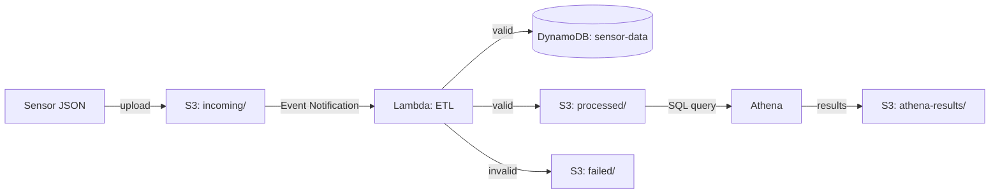

# Serverless Sensor Data Pipeline

A serverless ETL pipeline that validates, enriches, and stores IoT sensor readings on AWS, with SQL analytics on top via Athena.

Built as a learning/portfolio project to practice an end-to-end serverless data flow: ingestion → validation → transformation → storage → analytics.

## Architecture



## How it works

1. A sensor reading is uploaded as a JSON file to the `incoming/` folder of an S3 bucket.
2. The upload triggers an S3 Event Notification, which invokes a Lambda function.
3. Lambda reads and validates the file:
   - Checks that `deviceId`, `temperature`, and `humidity` are present
   - Checks that `temperature` is between -40 and 150, and `humidity` is between 0 and 100
   - If any check fails, the record is treated as invalid
4. Valid records are enriched:
   - `timestamp` is added if it's missing from the original payload
   - a `status` is assigned based on `temperature`: below 30 → `NORMAL`, 30–50 → `WARNING`, 50 and above → `CRITICAL`
   - `processedAt` is added, recording when the record was processed
5. The enriched record is written to the `sensor-data` DynamoDB table.
6. The same enriched JSON is also written to the `processed/` folder in the same bucket (same file name, with the `incoming/` prefix replaced by `processed/`).
7. If validation fails, the original (raw) file is copied to the `failed/` folder and the error is logged — so invalid records can be inspected later instead of being silently dropped.
8. Athena runs SQL queries against the data in `processed/`; query results are saved to the `athena-results/` folder.

## Example

**Input** (uploaded to `incoming/`):
```json
{
    "deviceId": "sensor004",
    "temperature": 45,
    "humidity": 25
}
```

**Output** (written by Lambda to `processed/` and to DynamoDB):
```json
{
  "deviceId": "sensor004",
  "temperature": 45,
  "humidity": 25,
  "timestamp": "2026-07-28T07:53:26.751073",
  "status": "WARNING",
  "processedAt": "2026-07-28T07:53:26.751087"
}
```

`temperature` is 45, which falls in the 30–50 range, so the record is tagged `status: WARNING`.

## AWS services used

| Service | Role |
|---|---|
| S3 | Stores raw (`incoming/`), enriched (`processed/`), invalid (`failed/`) files, and Athena query results (`athena-results/`) |
| Lambda | Runs the ETL logic — validation, enrichment, routing |
| DynamoDB | Stores validated sensor readings (`sensor-data` table) |
| Athena | Runs SQL analytics on top of the `processed/` data |

## Project structure

```
.
├── lambda/
│   └── etl_handler.py
├── README.md
└── docs/
    └── ARCHITECTURE.md   # per-service breakdown (IAM, S3, DynamoDB, Athena) — coming soon
    └── S3.md
    └── DynamoDB
    └── Athena
```

*(adjust paths above to match your actual repo layout)*

## Notes

- This is a learning/portfolio project. Production use would need further hardening (retry logic, a dead-letter queue, stricter validation, etc.).
- A detailed, service-by-service breakdown (IAM roles, bucket policies, Athena table definition, etc.) will live in `docs/ARCHITECTURE.md`.
